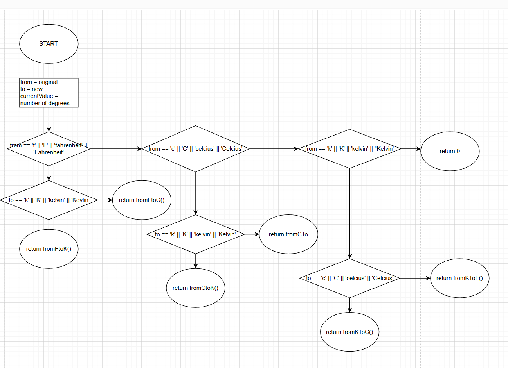
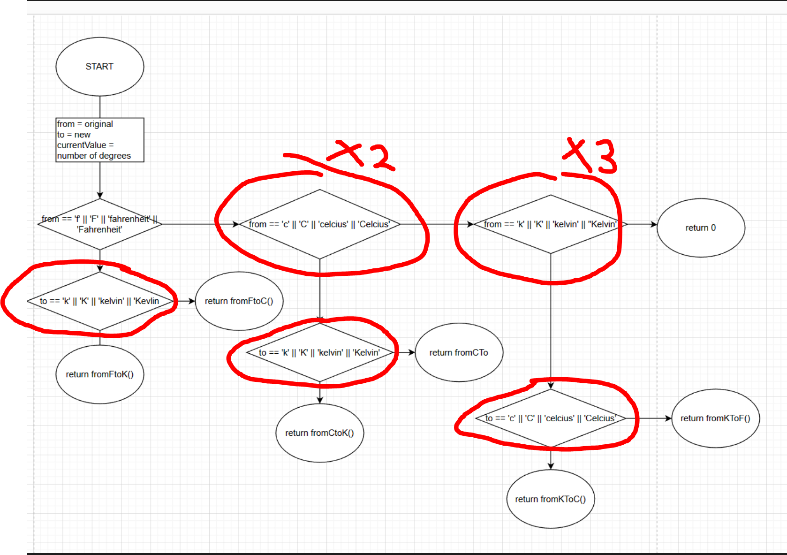
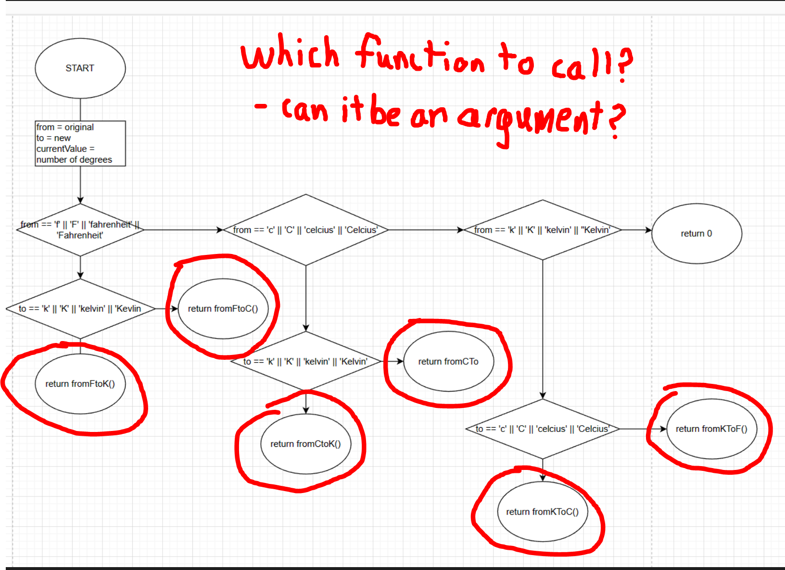
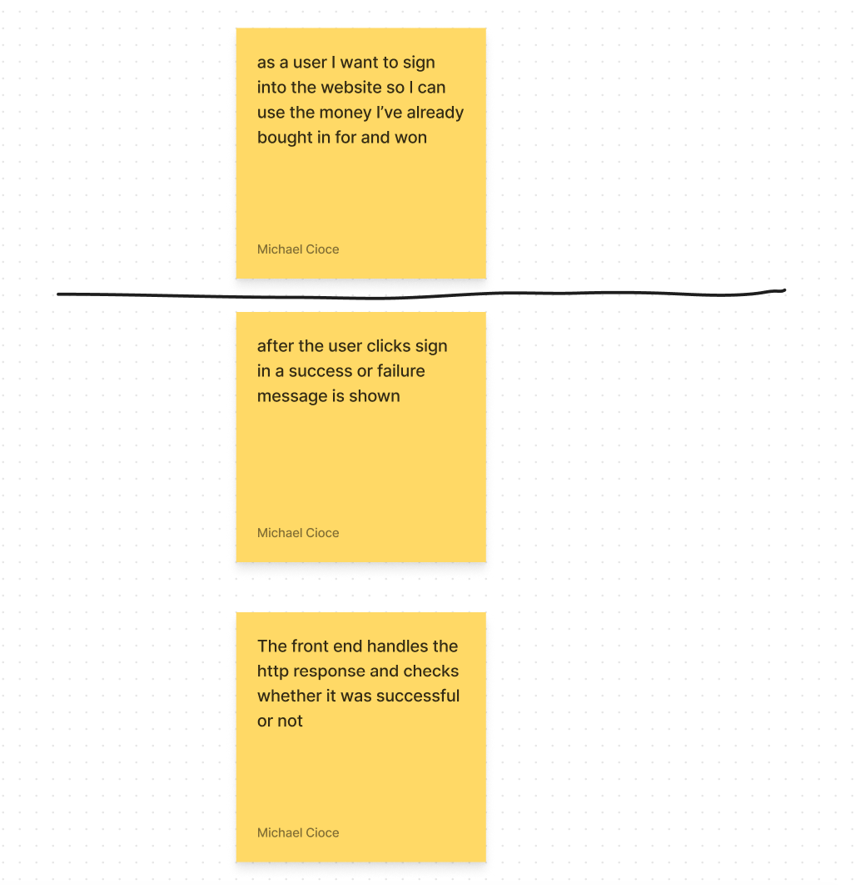
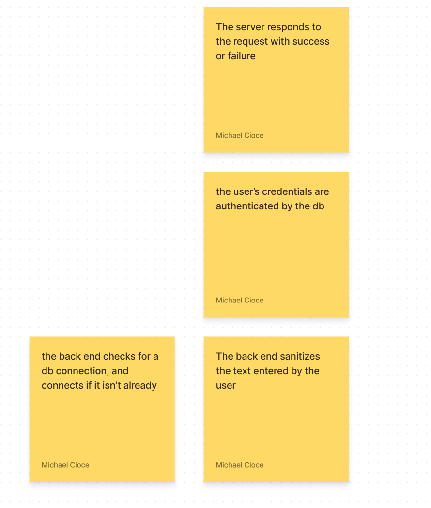
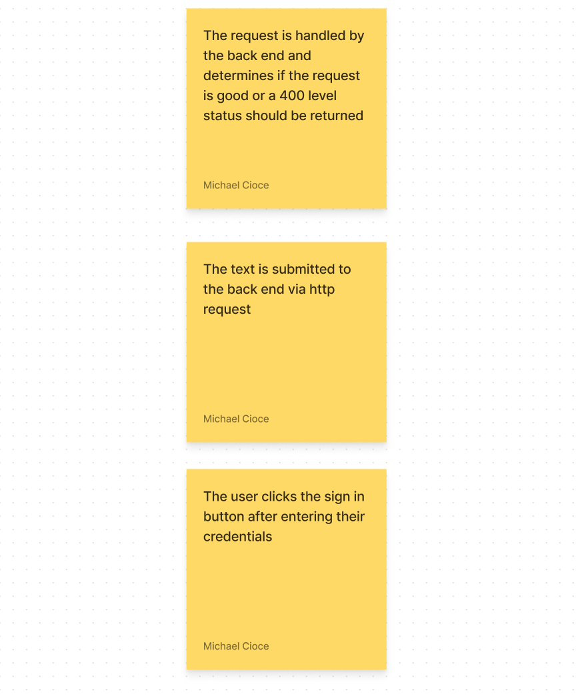
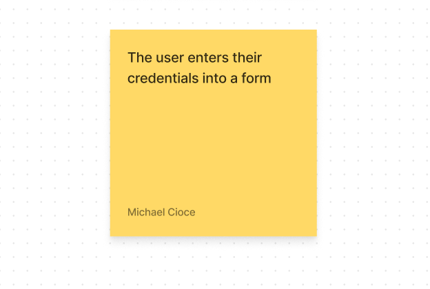

# CTAC_SG_1: Basic Coding Problem Solving Paradigms and Tools

## 1) Input - Processing - Output

IPO (or Input Processing Output) is a basic but effective paradigm to use when coding. It separates the program execution into 3 distinct parts:

1. Input: This stage of execution is dedicated to getting any values that are needed for the program to execute. It could be reading a file, calling a database, making a web request, or simply accepting input from a keyboard.

2. Processing: During this stage of execution, we use the input(s) we gathered to perform some action or task with them. It could be as simple as adding two numbers you got from a user, or as complicated as calculating a DNA sequence.

3. Output: After acting on the input data, we need to collect the output of that processing and return it. Again this could mean writing something to a file or printing something on the screen or sending a response to a recieved web request

* I think it's useful to note that this pattern is also seen in most functions:

```javascript
function temperatureConversion(from,to,fromTempValue) { //parameters hold the input
    (if from == "f" && to = "c"){ // logic here to determine processing course
        return fahrenheitToCelcius(fromTempValue); //function call to perform processing, then returning the returned value as output
    }
}

function fahrenheitToCelcius(f) { // the parameters hold the input
    let celcius = (f-32)/1.8; // using that input to do some processing
    return celcius; //outputing a value based on the processing result
}
```

## 2) PseudoCode/Logic Flow Diagrams

Some people can hold everything in their head as they're working on it, and for the rest of us there's pen and paper

Two tools for working out the logic of a problem are pseudocode and logic flow diagrams. The nice thing there isn't a formal way to do it but whatever works best for you.

For example, let's look at the temperature conversion function above:

```javascript
function temperatureConversion(from,to,fromTempValue){
    //logic here
}
```

my pseudocode for this function might look like this (well it does look like this):
```
There are three commonly used temperature to support - kelvin, celcius, and fahrenheit, and each can be converted from one to the other:

IF from == fahrenheit
THEN IF to == kelvin -> return fToKConversion()
     ELSE return fToCConversion()
IF from == celcius
THEN IF to == kelvin -> return cToKConversion()
     ELSE return cToFConversion()
IF from == kelvin
THEN IF to == celcius -> return kToCConversion()
     ELSE return kToFConversion()
```

Sometimes it's also helpful to visualize the flow of logic in a diagram. Here are the rules I use to build mine:

1. Establish "cardinal directions" that have prescribed meaning: e.g.
* at points where a TRUE/FALSE must be evaluated, I pick down to be TRUE and right to be FALSE
* I usually pick down to be the general direction of flow to the diagram but will use arrows to clearly point in the flow direction.
2. Use different shapes and icons for different components: e.g.
* CIRCLES I use to indicate a starting or ending point
* SQUARES/RECTANGLES are used to encapsulate a block of statements or are used to represent functions/ abstract a set of logic to make things easier to read
* DIAMONDS are used for points where a TRUE/FALSE value must be evaluated (as stated previously, since I've already chosen a direction for TRUE and FALSE, I don't have to worry about writing which is which)
* ARROWS are used to help point in the direction of the logic flow. 

Based on these rules here's what I came up with for the logic diagram:


As contrived as this sounds this diagram made me realize two things about this function I'm writing:

1. I am writing the same code multiple times:


2. This function is basically just decision logic on what function to call, and I've limited that to only 3 types essentially. for a true temp conversion all you need is 1) the current value and 2) the expression to convert it to something else. Therefore it would be nice to include a parameter that holds a function as an argument for conversion to a lesser known/ new temperature.


3. And a bonus observation: returning 0 isn't helpful because 0 can't be differentiated between an error code or a legitimate return value. Better to return null or a string of text maybe.

based on those observations here is my new iteration of the function:

```javascript
function tempConversionLogic(from,to,value,customFunc) {
    if(customFunc != null && customFunc instanceof Function ) {
        return customFunc(value);
    }
    if(isF(from)){
        if(isC(to)){
            return fToC(value);
        } else { //kelvin
            return fToK(value);
        }
    }
    if(isC(from)){
        if(isF(to))
            return cToF(value);
        else //kelvin
            return cToK(value);    
    }
    if(isK(from)){
        if(isF(to))
            return kToF(value);
        else // celcius
            return kToC(value);
    }
    return null; //no matching conversion and no custom function;
}

//implementations of the other functions here
```

## 3) Dependency Graphs / Tasking

Another helpful tool for problem solving / developing a feature is to break it down into components that make up the completed feature. This is called tasking. It can also be considered somewhat of dependency graphing depending on how you task it.

e.g. let's say you want to build a baseball simulator for your friend who is a baseball gambling addict. You're hoping that by being able to bet on fake games with fake money will scratch his gambling itch.

your minimum viable product is a baseball game he can "watch" in real time on a website that he can place bets on with "real" money. 

This is obviously a complex task so let's just look at one use case: signing in







Here I've detailed a dependency graph where each sticky note requires some amount of coding/task completion, not to say anything of styling, UX, or db implementation.

## 4) Practice Problems

Here are some problems to practice some of these techniques on:

https://leetcode.com/problems/sum-of-unique-elements/
https://leetcode.com/problems/how-many-numbers-are-smaller-than-the-current-number/
https://leetcode.com/problems/teemo-attacking/
https://adventofcode.com/2022/day/4


